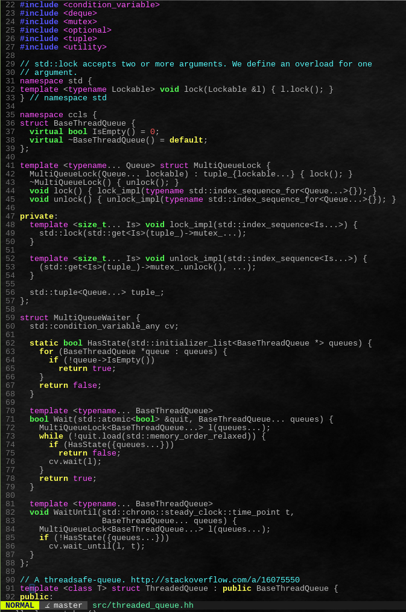

# vim-lsp-cxx-highlight

vim-lsp-cxx-highlight is a vim plugin that provides C/C++/ObjC semantic highlighting
using the language server protocol.

## Introduction

How does this plugin differentiate itself from
[color_coded](https://github.com/jeaye/color_coded) and
[chromatica](https://github.com/arakashic/chromatica.nvim)?

vim-lsp-cxx-highlight does no compilation/analysis of source files. It receives all 
of its semantic highlighting data over the language server protocol.
The main advantage of this plugin is that it is written entirely in vimscript.

The idea for this came from [vscode-cquery](https://github.com/cquery-project/vscode-cquery)
and seeing how it uses cquery to provide semantic highlighting.

Left: No Plugin, Right: vim-lsp-cxx-highlight + cquery

<span>


</span>

## Requirements

The plugin requires `vim` or `neovim`. For `vim` `+timers` and `+byte_offset` are
recommended but not required.

Additionally a compatible language server and language server client is required.

The following language servers and protocol extensions are supported:

- **[cquery](https://www.github.com/cquery-project/cquery)**
  - `$cquery/publishSemanticHighlighting` - semantic highlighting
  - `$cquery/setInactiveRegions` - preprocessor skipped regions

- **[ccls](https://www.github.com/MaskRay/ccls)**
  - `$ccls/publishSemanticHighlight` - semantic highlighting
  - `$ccls/publishSkippedRegions` - preprocessor skipped regions

The following language server clients are supported:

- **[vim-lsp](https://www.github.com/prabirshrestha/vim-lsp)**
- **[LanguageClient-neovim](https://github.com/autozimu/LanguageClient-neovim)**
- (PRs would be appreciated!)

## Install

Using [vim-plug](https://www.github.com/junegunn/vim-plug) (Or use the plugin manager of your choice)

```vim
Plug 'prabirshrestha/vim-lsp' " vim-lsp
" or
Plug 'autozimu/LanguageClient-neovim' " LanguageClient-neovim

Plug 'jackguo380/vim-lsp-cxx-highlight'
```

For `cquery` the following initializationOptions are needed:
```json
{
    "highlight": { "enabled" : true },
    "emitInactiveRegions" : true
}
```

For `ccls` if your `vim` does _not_ have `+byte_offset` or your code contains CRLF/dos line endings this initializationOption is needed:
```json
{
    "highlight": { "lsRanges" : true }
}
```

For a sample vim-lsp configuration see [this](sample-vimrcs/vim-lsp-register.vim)

For a sample LanguageClient-neovim configuration see [this](sample-vimrcs/LanguageClient-register.vim)

## Configuration

The plugin should work without any additional configuration. But if you don't like
the default settings see `:help vim-lsp-cxx-highlight`

## License

[MIT License](LICENSE.txt)
