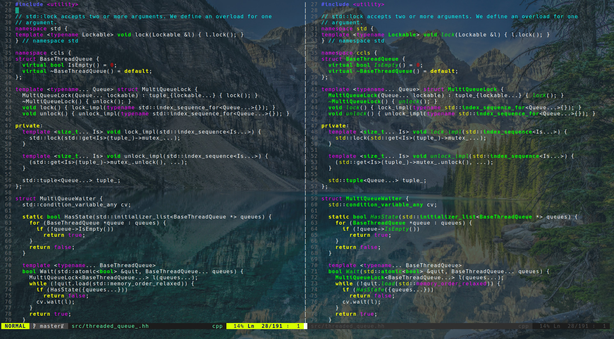

# vim-lsp-cxx-highlight

vim-lsp-cxx-highlight is a vim plugin that provides C/C++/Cuda/ObjC semantic highlighting
using the language server protocol.

## Introduction

How does this plugin differentiate itself from
[color_coded](https://github.com/jeaye/color_coded) and
[chromatica](https://github.com/arakashic/chromatica.nvim)?

vim-lsp-cxx-highlight does no compilation/analysis of source files. It receives all 
of its semantic highlighting data over the language server protocol.
The main advantage of this plugin is that it is written entirely in vimscript.

The idea for this came from [vscode-cquery](https://github.com/cquery-project/vscode-cquery)
and seeing how it uses cquery to provide semantic highlighting.

Left: No Plugin, Right: vim-lsp-cxx-highlight + ccls



## Requirements

The plugin requires `vim` or `neovim`. For `vim` `+timers` and `+byte_offset` are
recommended but not required.

Additionally, a compatible language server and language server client is required.

The following language servers and protocol extensions are supported:

- **[cquery](https://www.github.com/cquery-project/cquery)**
  - `$cquery/publishSemanticHighlighting` - semantic highlighting
  - `$cquery/setInactiveRegions` - preprocessor skipped regions

- **[ccls](https://www.github.com/MaskRay/ccls)**
  - `$ccls/publishSemanticHighlight` - semantic highlighting
  - `$ccls/publishSkippedRegions` - preprocessor skipped regions

- **[clangd](https://clangd.llvm.org)**
  - **Requires** [coc.nvim](https://github.com/neoclide/coc.nvim) and [coc-clangd](https://github.com/clangd/coc-clangd)
  - Using the proposed [Semantic Highlighting Protocol](https://github.com/microsoft/language-server-protocol/issues/18)
  - **IMPORTANT:** coc-clangd supports 2 implementaions: "semantic highlighting" (old, non-standard)
  and "semantic tokens" (new, LSP standard). The latest versions of clangd (12+) require disabling
  coc's semantic tokens to work; see below.

The following language server clients are supported:

- **[vim-lsp](https://www.github.com/prabirshrestha/vim-lsp)**
- **[LanguageClient-neovim](https://github.com/autozimu/LanguageClient-neovim)**
- **[coc.nvim](https://github.com/neoclide/coc.nvim)**
- **[nvim-lsp](https://github.com/neovim/nvim-lsp)**

## Install

Using [vim-plug](https://www.github.com/junegunn/vim-plug) (Or use the plugin manager of your choice)

```vim
Plug 'prabirshrestha/vim-lsp' " vim-lsp
" or
Plug 'autozimu/LanguageClient-neovim' " LanguageClient-neovim
" or
Plug 'neoclide/coc.nvim' " coc.nvim
" or
Plug 'neovim/nvim-lsp' " nvim-lsp

Plug 'jackguo380/vim-lsp-cxx-highlight'
```
Using vim8's native package manager (Run this command in a terminal)

```bash
git clone https://github.com/jackguo380/vim-lsp-cxx-highlight.git ~/.vim/pack/vendor/start/vim-lsp-cxx-highlight
```

For `cquery` the following initializationOptions are needed:
```json
{
    "highlight": { "enabled" : true },
    "emitInactiveRegions" : true
}
```

For `ccls` the following initializationOptions are needed:
```json
{
    "highlight": { "lsRanges" : true }
}
```

For `clangd` `coc-settings.json` must have:
```json
{
    "clangd.semanticHighlighting": true,
    "coc.preferences.semanticTokensHighlights": false
}
```

For a sample vim-lsp configuration see [this](sample-configs/vim-lsp-register.vim)

For a sample LanguageClient-neovim configuration see [this](sample-configs/LanguageClient-register.vim)

For a sample coc.nvim coc-settings.json see [this](sample-configs/coc-settings.json)

For a sample nvim-lsp configuration see [this](sample-configs/nvim-lsp-register.vim)

## Configuration

The plugin should work without any additional configuration. But if you don't like
the default settings see `:help vim-lsp-cxx-highlight`

### Vim Text Properties

vim-lsp-cxx-highlight now has support for Vim 8.1's text properties (See `:help textprop`).

What using text-properties improves:
 - Highlighting moves around with the text, inserting new lines/words no longer messes things up
 - Deleting lines removes highlighting attached to text
 - Some performance improvements? (Unverified)

Support for this feature has been tested on Vim version `8.1.1722`, older versions may have problems.
It is recommended to upgrade to this version or newer.

To enable:
```vim
let g:lsp_cxx_hl_use_text_props = 1
```

**Note:** This is now automatically enabled for vim version 8.2 or greater

This is a experimental feature, so it may be quite buggy. Please file bug reports!


## License

[MIT License](LICENSE.txt)
